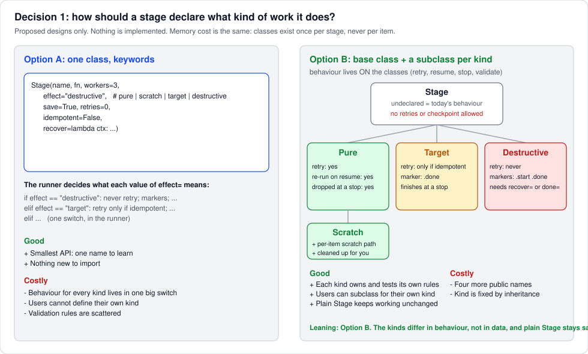
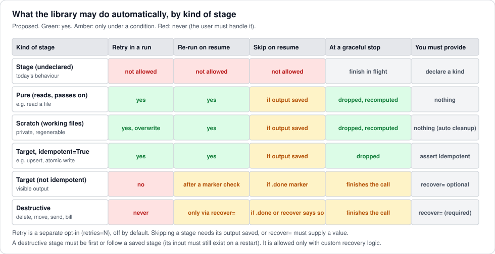
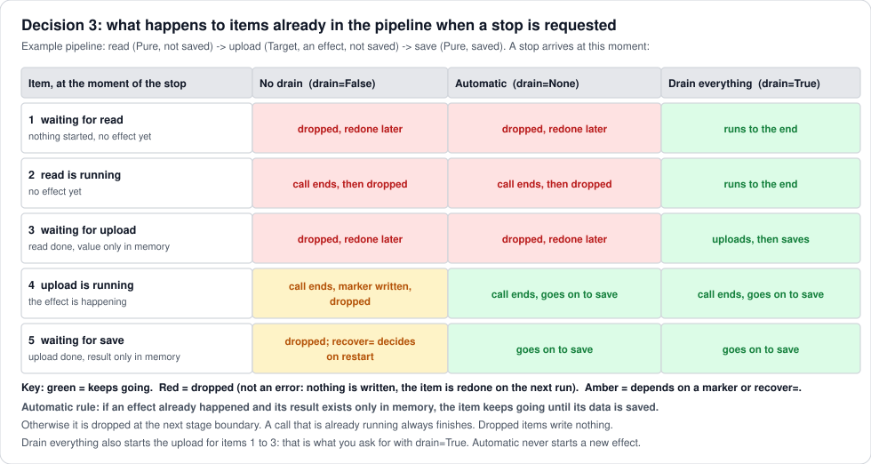

# Review guide: stage classes, custom recovery, stop modes

Status: **proposed, for the maintainer's review**. Nothing here is built. This note is meant to be
read top to bottom in about ten minutes. The diagrams are generated by
[`make_diagrams.py`](make_diagrams.py) from the proposal, so they can be regenerated when the
proposal changes. Background and the two independent reviews are in [architecture.md](architecture.md).

**Rules every option below must respect:** memory independent of the number of items, standard
library only, no database, today's behaviour unchanged unless you opt in
([principles.md](principles.md)).

## What you decided so far

| #               | Decision                                                                                                                                                                                                                                                                                                     | Status                                        |
| --------------- | ------------------------------------------------------------------------------------------------------------------------------------------------------------------------------------------------------------------------------------------------------------------------------------------------------------ | --------------------------------------------- |
| Contract        | Contract by boundary (retry needs no serialization; resume needs a key and a serializable stored value; process stages need picklable values)                                                                                                                                                                | **agreed**                                    |
| Resume          | Resume means "re-run the failed stage from its last saved boundary" (not inside a running stage)                                                                                                                                                                                                             | **agreed**                                    |
| Custom recovery | The user can supply custom resume and recovery logic (a lambda is enough). It also lifts the ban on retrying or re-running a destructive stage: the library then requires that logic instead of forbidding the stage. Checked when the stage is created. A validation operation or CLI is a feature request. | **agreed, details below**                     |
| Key and attempt | Stage functions can reach their item's key and attempt number                                                                                                                                                                                                                                                | **agreed** (mechanism: `stagepipe.current()`) |
| Stage classes   | **Decided: Option B**, a base class and a subclass per kind with the behaviour on the classes. The names of the kinds are still open (decision 9).                                                                                                                                                           | **decided**                                   |

---

## 1. Decision 1: one class with keywords, or a class per kind?

<< whast the difference between Pure and Target?  really dont like the names . For the destructive (lets chnge that name) we only allow it to be rerun if a recovery/resume logic is proviced. The cost of clsses shouldn be tht high >>

> **Answer to the comment above**
>
> **The difference between Pure and Target is whether the stage changes anything outside the pipeline.**
>
> | Kind (current name) | What it does                                                                                        | Example                                                                | What the library may do                                                     |
> | ------------------- | --------------------------------------------------------------------------------------------------- | ---------------------------------------------------------------------- | --------------------------------------------------------------------------- |
> | Pure                | Only computes a value and passes it on. Running it twice changes nothing in the world.              | read a file, parse, OCR, ask a model                                   | retry, redo and drop it freely                                              |
> | Scratch             | Writes only the pipeline's own working files. Same freedom as Pure.                                 | convert into a temporary file                                          | redo freely; clean the files up                                             |
> | Target              | Changes something other people or systems can see. Running it twice may do the visible thing twice. | write the final output file, upload, update a database, send a message | repeat only if you promise it is safe (idempotent) or supply recovery logic |
> | Destructive         | Deletes, moves or overwrites a source, or does something that cannot be undone.                     | delete the original, send a letter, charge a card                      | never repeat on its own; repeat only through your recovery logic            |
>
> So Pure versus Target asks "does it touch the outside world?", and Target versus Destructive asks
> "can its effect be repeated or undone harmlessly?".
>
> **Names.** Agreed: Pure, Target and Destructive describe my reasoning more than what a user sees. Three
> candidate sets, in plain words:
>
> | Current     | Set 1: by "safe to repeat?" | Set 2: by what it does | Set 3: short |
> | ----------- | --------------------------- | ---------------------- | ------------ |
> | Pure        | `Repeatable`                | `Compute`              | `Safe`       |
> | Scratch     | `Scratch`                   | `Scratch`              | `Scratch`    |
> | Target      | `Effect`                    | `Write`                | `Careful`    |
> | Destructive | `Irreversible`              | `Remove`               | `Once`       |
>
> Set 1 names the thing that drives the behaviour (may the library repeat it or not), so the name
> already tells the reader what to expect. Set 2 reads naturally but is not accurate: an upload or a
> message is not a "Write" to a file, and sending a letter is not a "Remove". Set 3 is short but vague.
> My recommendation is **Set 1**; `Output` would be an alternative to `Effect`. This is new decision 9
> below.
>
> **Destructive stages.** Agreed, and already the proposal: such a stage may be re-run only if recovery
> logic is provided. Without it the stage is refused when it is created (section 2).
>
> **The cost of classes.** Agreed, I overstated it. It is four extra names to learn; there is no memory
> cost and no cost per item.

You asked how the classes would look if behaviour lives on the classes themselves. This is the
picture. **Option A** keeps one `Stage` and a keyword `effect=`; **Option B** makes the kinds
real classes.



### What Option B looks like in code (sketch)

```python
class Stage:                      # UNDECLARED: exactly today's behaviour. No retries, no checkpoint.
    def __init__(self, name, fn, workers=1, ordered=False, init=None, close=None,
                 *, save=False, retries=0, backoff=0.5, retry_on=Exception, recover=None): ...

    # behaviour: the runner asks the stage; defaults below are overridden per kind
    def check(self, position, stages): ...       # raise ValueError for an invalid declaration
    def may_retry(self, attempt, exc): ...       # may this failure be retried automatically?
    def on_resume(self, ctx): ...                # -> Skip(value) | Rerun() | Fail(reason)
    def on_stop(self, ctx): ...                  # keep going to the end (True) or drop at the boundary (False)

class Pure(Stage):        ...                    # reads and passes on: retry yes, re-run yes, drop at a stop yes
class Scratch(Pure):      ...                    # + a per-item scratch path, cleaned up for you
class Target(Stage):      ...                    # visible output: retry only if idempotent=True, else a .done marker
class Destructive(Stage): ...                    # delete, move, send, bill: never blind; needs recover=
```

Using it:

```python
run(items, [
    Pure("read", read_file, workers=4),
    Scratch("convert", convert, workers=3),                       # writes working files
    Target("upload", upload, idempotent=True, retries=3),         # safe to repeat
    Destructive("delete_source", delete,                          # needs custom recovery logic
                recover=lambda ctx: Skip() if not os.path.exists(ctx.value) else Rerun()),
], checkpoint="work/", key=lambda it: it.id)
```

A user can define a kind of their own by subclassing and overriding a behaviour:

```python
class Billed(Target):                                             # never retried, always finishes at a stop
    def may_retry(self, attempt, exc): return False
```

How the runner uses the classes, so memory stays flat: it asks each stage **once at the start** (for
example to build the "keep going at a stop" table). Nothing is created per item. The per-item work is
the same as in Option A.

### Why I lean to Option B (and what the reviewer said)

- The kinds differ in **behaviour**, not in data, so putting the behaviour on the class is the natural
  place. Each kind owns its rules and its tests, and checks its own declaration.
- Plain `Stage` keeps working exactly as today. It is also the "undeclared" case, so the safe default
  ("ask the user to declare a kind before retries or checkpoints") needs no extra rule: a plain `Stage`
  simply refuses those options.
- Users can add their own kind.
- The reviewer preferred keywords because classes can multiply combinations. Here only the **effect**
  varies by class; `save`, `retries` and `recover` stay ordinary parameters on every class, so there is
  no explosion.
- Cost: four more public names (`Pure`, `Scratch`, `Target`, `Destructive`), and a stage's kind is fixed
  by its class.

---

## 2. Decision 2 (agreed) and custom recovery logic

Resume means: when a run is restarted, each item continues from the **last saved boundary**. A stage
that failed or was interrupted is re-run from its saved input. Resuming inside a running stage is not
possible and is not promised.

### The `recover=` hook (your idea, made concrete)

`recover` is a function (a lambda is enough) that the library calls **on a restarted run**, for an item
that reaches this stage and has a trace of an earlier attempt (a marker, or a saved output). It returns
one of three decisions:

| Return         | Meaning                                                                    |
| -------------- | -------------------------------------------------------------------------- |
| `Skip(value)`  | The work is already done. Pass `value` (default `None`) to the next stage. |
| `Rerun()`      | Run the stage again.                                                       |
| `Fail(reason)` | Do not decide automatically; the item becomes a `Failed` for a human.      |

The function receives a small context object:

| Field                       | What it is                                                                          |
| --------------------------- | ----------------------------------------------------------------------------------- |
| `ctx.key`, `ctx.index`      | The item's stable key and its position                                              |
| `ctx.value`                 | The stage's **input** (so a delete stage can see which file it was about to delete) |
| `ctx.began`, `ctx.finished` | Whether this stage's start marker and done marker exist                             |
| `ctx.saved`                 | The saved output of this stage, if any                                              |
| `ctx.attempt`               | How many attempts happened in the previous run (if known)                           |

Examples:

```python
# a delete: if the file is already gone, count it as done
Destructive("delete_source", delete,
            recover=lambda ctx: Skip() if not os.path.exists(ctx.value) else Rerun())

# a billed call: ask the provider whether the charge already happened
Target("charge", charge,
       recover=lambda ctx: Skip(find_invoice(ctx.key)) if invoice_exists(ctx.key) else Rerun())

# give up and let a human decide
Destructive("send_letter", send, recover=lambda ctx: Fail("check the outbox first"))
```

### How it relaxes the rules for destructive stages

Without `recover`, a destructive stage is **refused** whenever retries or a checkpoint are on (a blind
repeat could delete or send twice). With `recover`, the stage is **allowed**, because the user supplied
the check that makes a repeat safe:

- A destructive or non-idempotent target stage **may be retried** (`retries=N`): before each retry the
  library calls `recover(ctx)`; `Skip` means the previous attempt did in fact happen, `Rerun` means try
  again.
- It **may be re-run on resume** under the same check.
- It may follow an unsaved stage: the position rule (see below) is relaxed because `ctx.value` is then
  documented as possibly missing and the user takes responsibility.

### An error handler for every stage (your addition)

Today `on_error` is one setting for the whole run. Proposal: each stage may have its own,

```python
Stage("ocr", read_page, on_error="log")                                 # log it, keep the item as Failed, carry on
Target("upload", upload, on_error=lambda stage, i, value, exc: None)    # or your own function
run(items, stages, on_error="raise")                                    # the run-wide default, as today
```

- Same forms as today: `"raise"`, `"collect"`, or a function `fn(stage, index, value, exc)` that returns
  the value to continue with, or raises to stop the run.
- A stage without its own handler uses the run's `on_error`. The run's default stays **`"raise"`** (the
  first error stops the run), so nothing changes unless you opt in.
- A ready-made **`"log"`** handler writes one line (stage, index, exception type and message) and keeps the
  item as a `Failed`. It writes to the error stream directly, so it imports nothing: the `logging` module
  is used only if you pass your own handler that uses it.
- Retries run **before** the handler: the handler sees an error only after the retries (and any recovery
  logic) have given up.

Your note said "a default one that only logs". If you mean that stages without a handler should log and
carry on by default, that changes today's behaviour (now one failure stops the run), which breaks the
rule that defaults never change. My recommendation is to keep `"raise"` as the default and offer `"log"`
as the one-word opt-in. This is new decision 10 below.

### When the problems are reported: at creation, not in the middle of a run

Errors are raised as `ValueError` with a message that says how to fix it:

| Where                  | Checked                       | Example message                                                                                                           |
| ---------------------- | ----------------------------- | ------------------------------------------------------------------------------------------------------------------------- |
| Creating a stage       | always                        | `Destructive stage 'delete_source' needs recover=; a blind repeat could delete twice`                                     |
| Creating a stage       | always                        | `Target stage 'upload' has retries=3 but is not idempotent; pass idempotent=True or recover=`                             |
| Creating a stage       | always                        | `Stage 'x' uses retries=; declare what it does (Pure, Target, ...)`                                                       |
| `run()` start          | only when `checkpoint=` is on | `stage 'delete_source' must be first or follow a stage with save=True (its input is lost on restart), or define recover=` |
| `run()` start          | only when `checkpoint=` is on | `key= is required with checkpoint=`                                                                                       |
| First checkpoint write | on first use                  | `result of stage 'ocr' for key 'p-17' cannot be serialized: ...`                                                          |

### Feature request: a way to check a pipeline without running it

A `stagepipe.validate(stages, checkpoint=..., key=...)` that runs all of the checks above and returns
the list of problems, and a command line wrapper (`python -m stagepipe check package.module:stages`).
A later extension could **simulate a resume** against a real checkpoint folder and report, per stage,
how many items would be skipped, re-run or sent to `recover`. Proposed as a separate, later issue; it
costs nothing at run time.

---

## 3. What the library may do, by kind of stage



Reading it: green means the library does it on its own; amber means only under a condition (an
`idempotent=True` assertion, a marker, or your `recover` logic); red means never automatically.
Retries stay a separate opt-in (`retries=N`, default 0). With `recover=` supplied, the red and amber
cells in the *Destructive* row become allowed under your logic, as described in section 2.

A working file (**Scratch**) is deliberately different from a target file and from a delete: it is
private to the pipeline and regenerable, so it can always be redone, and the library can clean it up.

---

## 4. Decision 3: what happens to items already in the pipeline when a stop is requested



The stop is requested by the caller (for example from a signal handler) as `run(..., stop=event,
drain=None, abort_wait=30.0)`. The library never installs signal handlers.

- **`drain=False`** drops everything that is not currently running, and finishes the calls that are.
- **`drain=None` (automatic, recommended default):** if an effect already happened and its result exists
  only in memory, the item keeps going until its data is saved; otherwise it is dropped at the next
  boundary. No new effect is started.
- **`drain=True`** lets everything in flight run to the end, including starting effects you have not
  started yet. This is the "wait for the next steps in memory" variant you asked for.
- A call that is already running always finishes. Dropped items write nothing and are counted as settled
  so the run cannot hang.
- An ordered stage processes only the contiguous prefix it already has.
- **Your decision:** the call **returns normally**, with `UNFINISHED` in place of every item that was
  dropped. A stop is a requested outcome, not an error. `stats.stopped` is set so a caller can tell a
  stop from a complete run (it is also the only signal with `keep_results=False`, where the call
  returns `None`). Cancel and Ctrl-C still raise.

---

## 5. Decisions for you

We also must have an optional error handler for each task (we can have a defautl ony that logs, for example)

Mark your choice and I will record it in [decisions.md](decisions.md) and the issues.

1. **Stage classes.** [ ] Option A, one class with keywords   [ X] **Option B, a base class and a
   subclass per kind (recommended)**   [ ] Option B plus a keyword shortcut
2. **Custom recovery.** Agreed. Confirm the details: [ ] `recover=` returns `Skip(value)` / `Rerun()` /
   `Fail(reason)` and gets the context above   [ X ] it relaxes the rules for destructive stages as
   described   [ ] errors are raised when the stage is created
3. **Stop result.** [ ] **Raise `Stopped`, or return partial results with `partial=True` (recommended)**
   [ X] Return normally with `UNFINISHED`
4. **Drain control.** [X ] **`drain=None/True/False`, automatic by default (recommended)**   [ ] Only
   automatic
5. **Undeclared stages.** [ x] **A plain `Stage` refuses `retries=` and `checkpoint=` but is fine with
   `stop=` (recommended)**   [ ] Refuse all three
6. **Release order.** [x ] 0.1.2 `close`, `abort_wait`, `current()` then 0.2 kinds, retries, stop, limiter
   then 0.3 checkpoint (recommended by the second review)   [ ] 0.2 includes a last-stage-only checkpoint
7. **Cuts.** [ x] Cut adaptive concurrency, mixed sync and async stages, and the in-bytes memory budget
   from the roadmap
8. **Validation tool.** [x ] Open an issue for `stagepipe.validate()` and a command line check (later)
   (the issue exists: #13)
9. **Names of the kinds** (see the answer in section 1). [ ] **Set 1: `Repeatable` / `Scratch` /
   `Effect` / `Irreversible` (recommended)**   [ ] Set 2: `ComputeOnly` / `Scratch` / `Write` / `Remove`
   [ ] Set 3: `Safe` / `Scratch` / `Careful` / `Once`   [ x] Other: I still dont like the name Ho about more math related name? (idenpontent, etc? what about datbase like names)
10. **Per-stage error handler.** [X ] **`on_error=` on each stage, run-wide default stays `"raise"`, plus a
    ready-made `"log"` (recommended)**    [ ] Stages without a handler log and carry on by default (changes
    today's behaviour)

**Status after your second pass:** decisions 5, 6 and 10 are decided as recommended (a plain `Stage`
refuses `retries=` and `checkpoint=` but is fine with `stop=`; release order 0.1.2, then 0.2, then 0.3;
`on_error=` per stage with `"raise"` as the run default plus a ready-made `"log"`). Still open: the names
(decision 9, round 2 below) and two details of decision 2 that were not ticked (the `Skip` / `Rerun` /
`Fail` shape of `recover=`, and errors raised when the stage is created; the second was agreed earlier in
conversation).

> **Answer to decision 9, round 2: math and database names, and a simplification that follows from them**
>
> Your request for math or database vocabulary points at the standard terms for exactly what the library
> cares about: **may this be run more than once?** That vocabulary is *idempotent* (math, databases) and
> *at-most-once* / *at-least-once* (messaging and databases).
>
> **A simplification I found while answering.** Check the matrix again: a *Target* stage that is not
> idempotent and a *Destructive* stage behave **identically** in every cell: never retried on its own,
> markers `.start` and `.done`, finishes its call at a stop, repeated only through your recovery logic.
> The only difference was the label. And an idempotent *Target* (an atomic write, an upsert) is just a
> repeat-safe stage. So the real kinds are not four, they are **two, plus the working-file variant**:
>
> | Kind | Meaning | What the library does |
> |---|---|---|
> | **repeat-safe** (covers old Pure, idempotent Target) | Running it again gives the same result: reading, parsing, OCR, an atomic write, an upsert | retry, redo and drop freely |
> | **Scratch** (a repeat-safe kind) | Same, and it writes working files | same, plus a per-item scratch path and cleanup |
> | **run-once** (covers old non-idempotent Target and Destructive) | Running it twice could do the effect twice: delete, send, bill, append | never repeated on its own; markers; repeated only through your `recover=` logic |
>
> The `idempotent=True` keyword then disappears: an idempotent write simply uses the repeat-safe kind.
> One fewer class and one fewer parameter, and no behaviour is lost. If you would still like a separate
> label for "visible output" versus "destructive" for documentation, that can be a name only.
>
> **Name sets** (the first two use the vocabulary you suggested):
>
> | Kind | Set 4: math and messaging | Set 5: database style (query/command) | Set 1 (old suggestion) |
> |---|---|---|---|
> | repeat-safe | `Idempotent` | `Query` | `Repeatable` |
> | working files | `Scratch` | `Scratch` | `Scratch` |
> | run-once | `AtMostOnce` | `Command` | `Irreversible` |
>
> ```python
> run(items, [
>     Idempotent("read", read_file, workers=4),                          # safe to repeat
>     Scratch("convert", convert, workers=3),                           # working files
>     Idempotent("upload", upload, retries=3),                          # an atomic upsert: repeat-safe
>     AtMostOnce("delete_source", delete,                               # never repeated without your logic
>                recover=lambda ctx: Skip() if not os.path.exists(ctx.value) else Rerun()),
> ], checkpoint="work/", key=lambda it: it.id)
> ```
>
> **My recommendation: Set 4.** `Idempotent` is the exact technical word for "the library may run this
> again", and `AtMostOnce` is the exact word for "the library will not run this twice on its own", so the
> names state the promise instead of my reasoning. Set 5 reads well and is familiar, but `Query` and
> `Command` suggest a database, which many users are not using. A plain `Stage` stays the undeclared
> default. If you accept the simplification, the diagrams and the matrix will be regenerated with the two
> kinds plus `Scratch`.
>
> **New decision 11:** merge Target and Destructive into one run-once kind. [ ] **Yes, merge
> (recommended)**   [ ] No, keep four kinds.
> **Decision 9, round 2:** [ ] **Set 4: `Idempotent` / `Scratch` / `AtMostOnce` (recommended)**
> [ ] Set 5: `Query` / `Scratch` / `Command`   [ ] Other: ______
